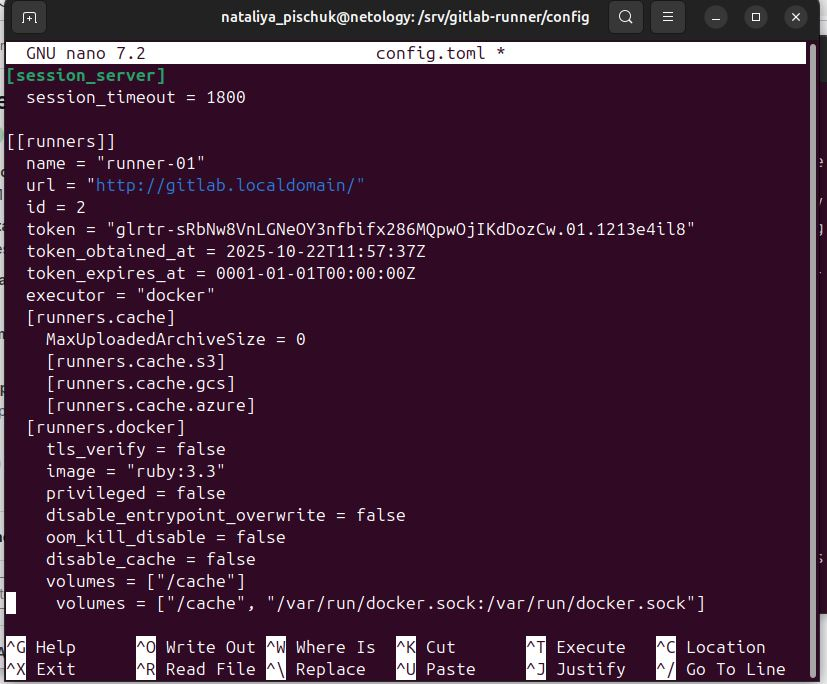

# Домашнее задание к занятию «GitLab» - Наталья Пищук
## Задание 1
Что нужно сделать:

1. Разверните GitLab локально, используя Vagrantfile и инструкцию, описанные в этом репозитории.
2. Создайте новый проект и пустой репозиторий в нём.
3. Зарегистрируйте gitlab-runner для этого проекта и запустите его в режиме Docker. Раннер можно регистрировать и запускать на той же виртуальной машине, на которой запущен GitLab.
В качестве ответа в репозиторий шаблона с решением добавьте скриншоты с настройками раннера в проекте.

## Решение 1
1-ый скриншот после установки Gitlab на локальную машину и входа на нее

2. Конфигурация Runner - config.toml

3. После запуска runner - заходим на репозиторий Gitlab и проверяем, что он runner появился в списке

